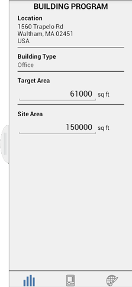

# 建物パフォーマンス

---

BIM ワークフローでは、最初に、設計プロセスの初期段階から各種要素のパフォーマンスを評価します。

### 建物パフォーマンス

| | |
| ---- | ---- |
|建物プログラムの画面には、建物タイプと外構領域が示されます。||

#### 参照

* [オブジェクトのプロパティを調べる ](../../Modify Designs/Examine Object Properties.md)
* [レベルと容積](../../Levels and Space Usage.md)

#### このセクションの内容

* [太陽と影の設定 ](../Sun and Shadow Settings.md)

日付と時刻を設定することにより、現在位置における影の角度をコントロールします。

* [日照解析](../Solar Analysis.md)

モデルの日照量を視覚化します。

