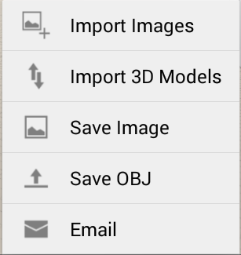

# 3D モデルとイメージを読み込む

---

さまざまな目的に応じてオーバーレイやイメージを設計に追加します。

イメージや既存の 3D モデルを追加すると、スケッチの情報を充実させることができます。

1. ローカルまたは A360 の記憶領域からイメージまたは 3D モデルを選択します。

イメージは拡大/縮小およびトリミングできます。その後、イメージをキャンバスに読み込みます。

1. 画面の右側にあるパレットを使用して、イメージのプロパティを修正します。

必要に応じて、イメージの名前と透過度を編集します。衛星画像を含め、さまざまな地面オーバーレイの縦方向の表示を管理します。

* OBJ または AXM 形式を使用して、ローカル ファイル システムからジオメトリを読み込むことができます。単にツールバーの[読み込み]アイコンをタップし、[3D モデルの読み込み]を選択します。注: システムからキャンバスへ OBJ または AXM ファイルをドラッグ アンド ドロップすることもできます。

