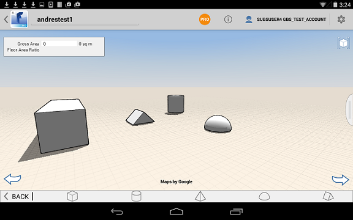

# 設計を作成する

---

グリッドのバックグラウンド、衛星画像、またはオーバーレイにジオメトリ形状をスケッチまたは配置します。

* 2D および 3D ジオメトリ作成ツールを使用して、コンセプト モデルを作成します。最初に 2D 形状をスケッチするか、3D プリミティブを配置します。次に、面をプッシュまたはプルしたり、さまざまな変換ツールやブール演算を使用して、設計を修正します。

ジオメトリを作成する方法には、形状をスケッチする方法とプリミティブを配置する方法の 2 通りがあります。ジオメトリは、読み込むこともできます。

スケッチに使用できるツールには線分、円弧、スプライン、長方形、円の 5 種類があります。

#### 形状をスケッチする

* 作成ツールはアクション バーにあります。 [スケッチ]ツール セットでツールをクリックし、形状を作成します。 次に、ビュー内をクリックして形状を定義します。

配置できる 3D プリミティブには立方体、ドーム、円柱、プリズム、角錐の 5 種類があります。

#### プリミティブを配置する

* プリミティブを配置するには、[ジオメトリ作成]ツールバーのツールをクリックします。次に、キャンバス内をクリックしてジオメトリを配置します。

形状をスケッチするか、プリミティブを配置した後、より複雑な設計を作成するには、いくつかのコンテキスト ツールを使用してジオメトリを修正します。選択、削除、移動、スケール、回転、押し出し、面の切り取り、面のオフセット、傾斜、コピー/貼り付け、配列、ブール演算(論理和、論理差)などの操作を行います。これらの操作の詳細については、次のリストのトピックを参照してください。

#### このセクションの内容

* [3D モデルとイメージを読み込む ](../Import 3D Models and Images.md)

さまざまな目的に応じてオーバーレイやイメージを設計に追加します。

* [形状をスケッチする](../Sketching Shapes.md)

線分、円弧、スプライン、長方形、円を使用して、建物設計に組み入れる形状を作成します。

* [プリミティブを配置する](../Place Primitives.md)

事前設定済みの形状を設計建物ブロックとして使用します。

