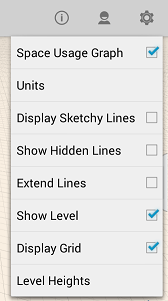
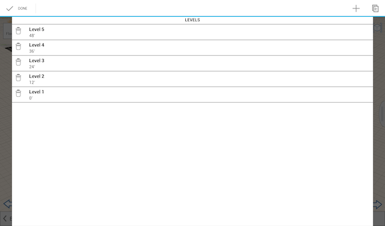

# レベルとスペースの用途

---

設計内のオブジェクトの面積計算を表示します。

## レベルを有効にする

1. [設定]をタップして、[レベルを表示]を切り替えます。

2. [レベルの高さ]をクリックして、レベルの値を追加または変更します。

## プロパティとスペースの用途

スケッチで選択した個々のオブジェクトのプロパティを表示または編集するには、[建物のプロパティ]タブの右側にあるパレットを開きます。[プロパティ]では、オブジェクトの名前を編集したり、その体積や面積を表示したり、レベルを切り替え、編集することができます。

* 左上にあるウィジェット パネルで[建物のエリア]を設定すると、スケッチ全体で[総面積]と[床面積率]が自動的に更新されます。この機能をアクティブにして、これらの数値に個別の要素を追加するには、各オブジェクトのプロパティで[レベル別の領域]をオンにする必要があります。

