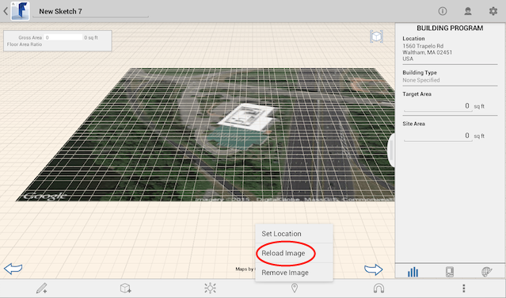
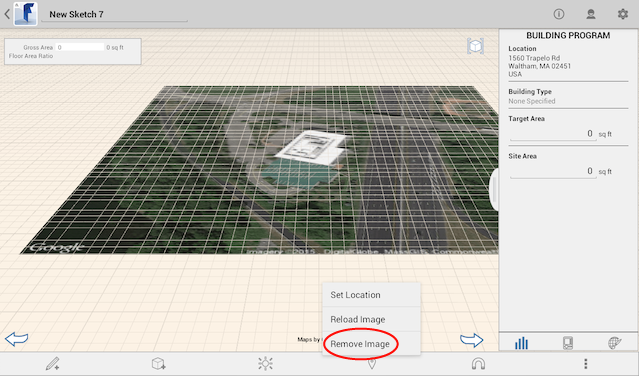

# 衛星画像を編集、再ロード、または削除する

---

位置のイメージを変更します。

## 衛星画像を使用して作業する

1. 再ロード。

2. 衛星画像を削除するには:

* 衛星画像をダブルタップし、[位置]をタップし、[イメージを削除]をタップします。
* 衛星画像をダブルタップして長押しすると表示されるコンテキスト メニューで、[X] (削除)をタップします。

3. イメージのプロパティ:

イメージの名前、透過度、または縦方向の配置を変更します。

