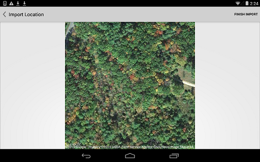

# 位置を設定する

---

スケッチの地理的位置を確定します。

## 位置を識別する

1. アクション バーの[位置]アイコン  をクリックします。
2. [検索]ウィンドウで位置を検索するか、マップを使用します。

3. 右上隅にある[イメージを読み込み]をタップして、衛星写真をロードします。
4. 衛星写真のズーム レベルを調整します。
5. [読み込みを終了]をタップします。

