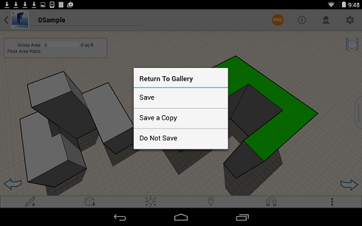

# 作業内容を保存する

---

さまざまな形式で設計を保存します。

* FormIt 360 アイコンをタップすると、デバイスのギャラリーからすべてのスケッチにアクセスできます。また、[http://360.autodesk.com](http://360.autodesk.com) からスケッチにアクセスすることもできます。 さらに、スケッチを保存する場合も、FormIt 360 アイコンをタップします。ギャラリーに戻るたびに、スケッチを保存するように促されます。ファイルをクラウドと同期するには、[http://360.autodesk.com](http://360.autodesk.com) にサインインします。

スケッチが [http://360.autodesk.com](http://360.autodesk.com) と同期されると、AXM、SAT、および RVT の 3 つの形式のファイルが作成されます。RVT 形式のファイルは、Revit ベースの製品で開くことができます。  Revit ファイルは、ローカルにダウンロードでき、Revit で直接開くことができます。

