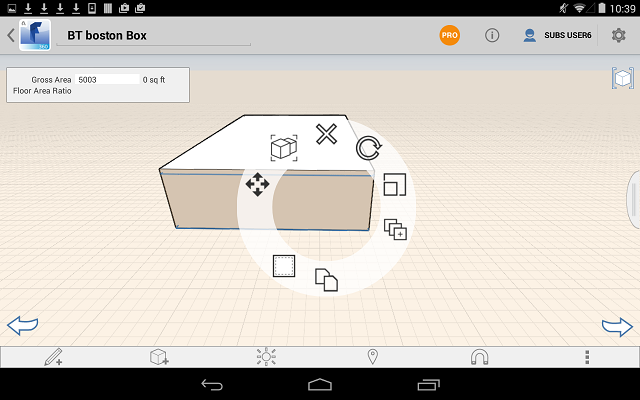
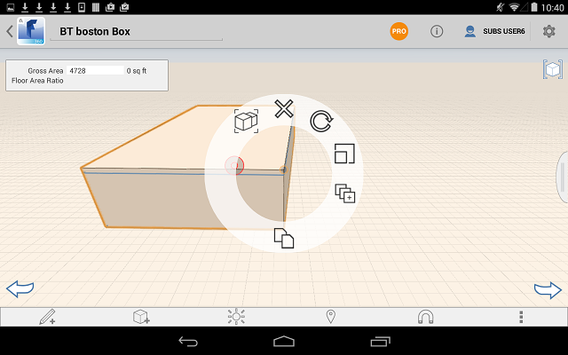
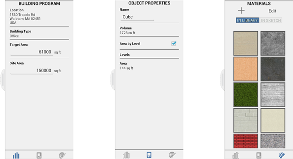

# コンテキスト メニューとパレット

---

設計を作成して配置するためのツールを見つけます。

## コンテキスト メニュー

* コンテキスト メニューを表示するには、オブジェクトを長押しします。

* ツールのメニューは、面、エッジ、または選択したその他のオブジェクトに応じて変わります。

### オブジェクト/マテリアル パレット

* 画面の右側のパレットには、[建物プログラム]、[プロパティ]、および[マテリアル]の 3 つのタブがあります。

