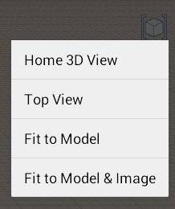
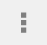

# ユーザ インタフェース ツール

---

コマンド操作ツールを紹介します。

* [ビュー設定]メニューでは、一連のプリセット ビューから選択することができます。 これらのビューでは、モデルをさまざまなパースやズーム レベルですばやく表示できます。
* アクション バーは画面の下部にあります。アクション バーのツールを使用すると、コンテンツを作成、編集、共有できます。

## アクション バー

* スケッチ ツール: これをクリックすると、形状を描画できる作成ツールのメニューが表示されます。
* プリミティブ: これをクリックすると、シーンに配置できる基本的な 3D 形状のメニューが表示されます。
* 光源と影を変更: このツールを使用すると、日時を変更できます。
* 位置を設定: 位置を検索し、衛星画像をスケッチに読み込みます。 スケッチの位置の設定方法について詳しくは、「位置」を参照してください。
* スナップ: グリッドにスナップするかどうかを切り替えます。
* 作業を共有: イメージを読み込むか、イメージを保存して電子メールで送信します。

