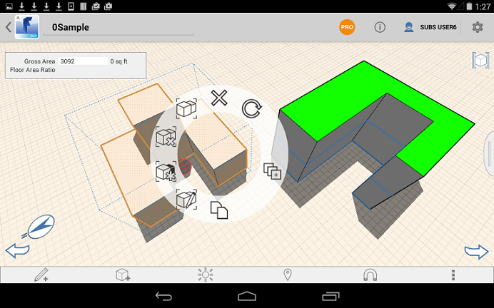

# オブジェクトをグループ化する/グループ化を解除する

---

操作を容易にするため、ジオメトリをクラスタにまとめます。

#### オブジェクトをグループ化する

1. グループ化するオブジェクト(面またはオブジェクト)をタップします。
2. オブジェクト付近を長押しすると、コンテキスト メニューが表示されます。

3. [グループ]アイコン  をタップします。
#### オブジェクトのグループ化を解除する

1. 既にグループ化されている一連の選択済みオブジェクトのグループ化を解除するには、[グループ化を解除]アイコン  をタップします。

