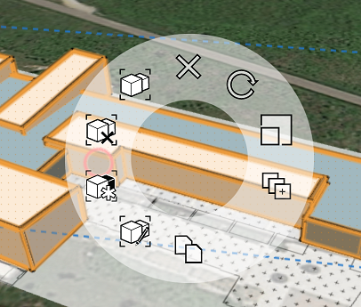

# グループを使用する

---

1 つまたは複数のオブジェクトをクラスタにまとめることで操作が容易になります。

グループ化を使用すると、ジオメトリをより効率的に作成できます。

* プリミティブを配置するか、形状をスケッチしてオブジェクトを作成した後、これらをまとめてグループ化することにより、再利用可能な単一オブジェクトとして処理することができます。1 つのグループをコピーして*インスタンス*を作成できます。インスタンスはリンクされているオブジェクト群であり、1 つのオブジェクトを変更すると他のすべてのオブジェクトも更新されます。 グループ化はスケッチを編成する場合や、類似オブジェクトをすばやく更新する必要がある場合に役立ちます。
* ツールバーを使用すると、グループ関連のツール([グループ化]、[グループ化の解除]、[ユニークにする]、[編集])にすばやくアクセスできます。これらのツールはコンテキスト メニューにも表示されます。ツールバーのツールを使用する場合は、最初に操作を選択し、次に操作の実行対象であるオブジェクトを選択します。コンテキスト メニューではこの順序が逆になります(クリック操作がさらに 1 回必要です)。最初にオブジェクトを選択し、次にそのオブジェクトに実行する操作を選択します。この操作/選択の順序の関係で、ツールバーの[編集]を使用すると、ネストされたグループは編集しやすくなります。また、G ([グループ化])、E ([編集])、F ([完了])、U ([グループ化の解除])、M ([ユニークにする])などのキーボード ショートカットを使用することもできます。

 

グループ化できるオブジェクト要素は、オブジェクト全体、面、独立しているエッジのみです。頂点および所有されているエッジはグループ化できません。注: [グループを編集]モードではレベルを適用できません。

#### このセクションの内容

* [オブジェクトをグループ化する/グループ化を解除する](../Group-Ungroup Objects.md)

操作を容易にするため、ジオメトリをクラスタにまとめます。

* [グループを編集する](../Edit Group.md)

既存のグループを更新または変更します。

* [グループをネストする](../Nest Groups.md)

設計内の類似した要素をクラスタ化します。

* [グループを拡大/縮小する](../Scale a Group.md)

他のインスタンスとの関係性を維持しながらグループ インスタンスを拡大/縮小します。

* [グループをユニークにする](../Make Group Unique.md)

オブジェクト セットをコピーした後、元のグループから切り離します。

* [レベルとマテリアルをグループに適用する](../Apply Levels and Materials to a Group.md)

多数のオブジェクトに対して一度に適用できる方法です。

* [グループ軸と作業面](../Group Axes and Work Planes.md)

