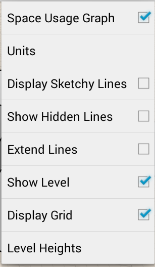

# 表示形式のオプション

---

表示スタイルの選択肢について説明しています。

### [表示スタイル]オプション

| | |
| ---- | ---- |
||[設定]メニューにアクセスするには、ツールバーの歯車アイコンをタップします。次のようないくつかのオプションを変更できます。* 使用量グラフ: 図面名のすぐ下に統計情報を表示するかどうかを切り替えます。* 単位: スケッチの単位(インチ/フィートまたはメートル)を指定します。* 手書き風の線を表示: 手書き風の線の表示/非表示を切り替えます。* 隠線を表示: 手書き風の線、隠線、延長線などの表示を切り替えて、スケッチの外観を変更します。* 延長線: 延長線の表示/非表示を切り替えます。* レベルを表示: レベルを表示します。* グリッドを表示: グリッドの表示/非表示を切り替えます。* レベルの高さ: レベルの高さを表示します。|

